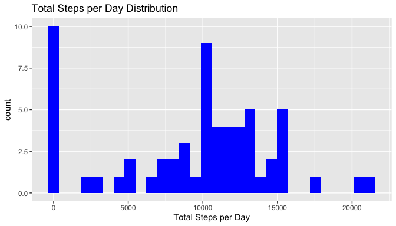
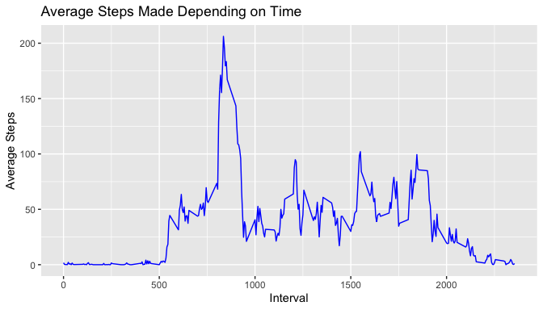
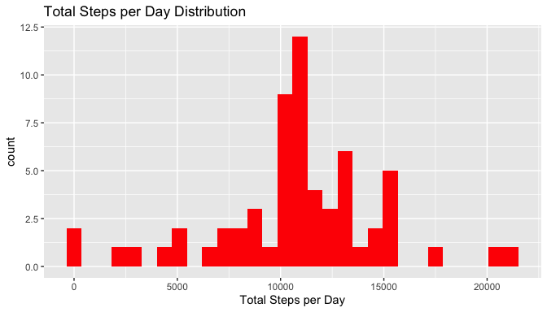
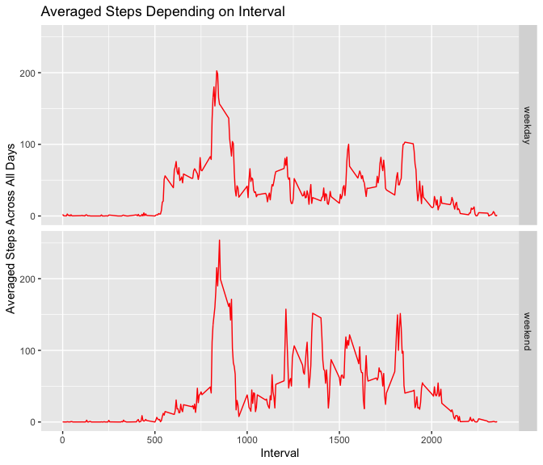

Packages needed for processing data

```r
library(dplyr, quietly = TRUE)
library(tidyr, quietly = TRUE)
library(ggplot2, quietly = TRUE)
library(lubridate, quietly = TRUE)
```

## 1. Loading and preprocessing the data

```r
unzip("activity.zip")
activity_df <- read.csv("activity.csv")
```
Column "date" needs conversion into date format

```r
activity_df$date <- ymd(activity_df$date)
```


## 2. What is mean total number of steps taken per day?
Data frame needs to be summarised by date

```r
activity_df_1 <- activity_df %>%
        group_by(date) %>%
        summarise(steps = sum(steps, na.rm = TRUE))
```

Histogram showing distibution of total steps per day.

```r
ggplot(activity_df_1, aes(x = steps)) + geom_histogram(fill = "blue") +
        labs(title = "Total Steps per Day Distribution",
             x = "Total Steps per Day")
```

<!-- -->

Mean calculation

```
## [1] 9354.23
```

Median calculation

```
## [1] 10395
```

## 3. What is the average daily activity pattern?
Summarising data by interval

```r
activity_df_2 <- activity_df %>%
        group_by(interval) %>%
        summarise(steps = mean(steps, na.rm = TRUE))
```


```r
ggplot(activity_df_2, aes(x = interval, y = steps)) + geom_line(color = "blue") +
        labs(title = "Average Steps Made Depending on Time",
             x = "Interval", y = "Average Steps")
```

<!-- -->

Calculation of the interval, when the maximum number of steps occurs

```r
activity_df_2[[which.max(activity_df_2$steps),1]]
```

```
## [1] 835
```

## 4. Imputing missing values
Check for missing values

```r
colSums(is.na(activity_df))
```

```
##    steps     date interval 
##     2304        0        0
```
  
Missing values should be replaced by interval mean across all dates.

To do so there was made 3 steps for each missing value:

1. determine the interval of NA
2. extract the vector of steps on this interval and calculate the mean
3. impute the mean value instead of NA  
On step 2, it is possible to use previously created data frame with everage 
means across all days

```r
activity_df_nona <- activity_df
for (i in which(is.na(activity_df_nona$steps))) {
        # step 1
        interval.value <- activity_df_nona[i, 3]
        
        #step 2
        steps.subset <- activity_df_nona[which(activity_df_nona$interval == interval.value), 1]
        mean.value <- mean(steps.subset, na.rm = TRUE)
        
        # step 3
        activity_df_nona[i, 1] <- mean.value
}
```

Summarising data and plotting results the same way as in second task

```r
activity_df_3 <- activity_df_nona %>%
        group_by(date) %>%
        summarise(steps = sum(steps))
```


```r
ggplot(activity_df_3, aes(x = steps)) + geom_histogram(fill = "red") + 
labs(title = "Total Steps per Day Distribution",
             x = "Total Steps per Day")
```

<!-- -->

Mean and median calculation

```r
mean(activity_df_3$steps)
```

```
## [1] 10766.19
```

```r
median(activity_df_3$steps)
```

```
## [1] 10766.19
```

## 5. Are there differences in activity patterns between weekdays and weekends?
For adding factor variable depending on the type of the weekday, function "wday" 
from lubridate package is used. The function returns an integer number of the 
weekday. This number allows to use the "cut" function.

```r
activity_df_4 <- activity_df_nona %>%
        mutate(weekdays = wday(date)) %>%
        mutate(weekday.type = cut(weekdays, breaks = c(0,5,7),
                                  labels = c("weekday", "weekend"))) %>%
        group_by(interval, weekday.type) %>%
        summarise(steps = mean(steps))
```


```r
ggplot(activity_df_4, aes(x = interval, y = steps)) + geom_line(color = "red") +
        facet_grid(weekday.type ~.) +
        labs(title = "Averaged Steps Depending on Interval",
             x = "Interval", y = "Averaged Steps Across All Days")
```

<!-- -->

**An activity during the weekends are higher then during the weekdays**
